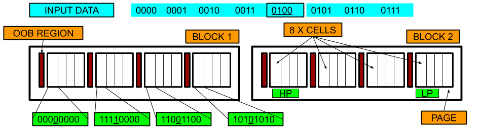

# ssd_sim

1. Running code

```
	mkdir build
	cd build
	cmake ../
	make
	./test
```

This repo contains multiple files that form the building block of an SSD - cell, page and block.

We want to build an SSD using different block/page and cell APIs provided in different \*.hpp files.

We use the gtest framework to test SSD code.

To see how each of the components can be called for reading and writing, please refer test.cpp.

While adding code, please also add relevant tests to the test.cpp file that test the newly added code.


2. Profiling code

To profile the code, you need to add an option for the compiler (`'-pg`). This is done in the CMake file in the `profiling` branch.

After making the file with necessary options, run the gprof tool to output the profiler results.

```
$  gprof test_gprof gmon.out > analysis.txt
```
